# Hi, I'm Rida Mansour :D

I started programming in 2016 at 10 years old on a Raspberry Pi—flashing OSes, terminal scripting, and breaking systems. By 9th grade, I turned that curiosity into structured engineering with Java—building a solid foundation in OOP, data structures, and system design through high school projects ranging from Android applications to Arabic NLP tools. That "open it up and see how it works" instinct has evolved directly into how I architect production systems today.

Today I'm an ML Engineer and Information Technology student (Dual Studies) at Al-Quds University, recently back from an exchange semester at Mälardalen University in Sweden. I specialize in taking complex ML systems end-to-end—from raw data foundations to production serving. My sweet spot is the retrieval → ranking → recommendation stack: getting the exact right thing in front of the right person.

---

## What I'm doing right now

* 🤖 **Conversational Agents & Perception Ensembles:** Architecting question-generation methodology for an AI Interview Agent from job descriptions and integrating a post-session perception scoring ensemble, including facial expression and emotion classification, gaze tracking for reading detection, and synthetic text/speech detection.

* 👗 **Hardening WardrobeGenie:** Scaling **WardrobeGenie** solo from a university project into a production-grade context-aware recommendation engine.

* 📚 **MLOps & Agentic AI:** Completing DeepLearning.AI's **MLOps Specialization** (focusing on data validation, concept drift, and human-level performance baselines) while building with **LangChain** and **LangGraph**.

* 🧠 **Local, LLM-Free AI:** Continuing to build fully local ML pipelines designed around deterministic inference, embedding-based retrieval, and commercially safe architectures without relying on external LLM APIs.

---

## How I work

I gravitate toward total system ownership over managing a narrow slice. Whether designing a Medallion data lake architecture with automated quality gates, building multi-stage ML retrieval and ranking systems, prototyping graph neural network (GNN) matching models, or authoring 80+ Architecture Decision Records to justify system boundaries, I prefer to go deep on one platform than skim across five.

---

## Toolbox

* **Languages & Core:** Python (Advanced), Java, Kotlin, Swift, SQL

* **AI & ML:** PyTorch, Graph Neural Networks (GNNs / PyTorch Geometric), Scikit-learn, Transformers, SBERT, Knowledge Distillation

* **NLP, CV & Perception:** LangChain, LangGraph, RAG Systems, Facial Expression & Emotion Classification, Gaze Tracking, Speech & Prosody Analysis, Synthetic Content Detection, Object Detection, U-Net Segmentation

* **Retrieval & Data Engineering:** Hybrid Search (BM25 + Dense Vectors + RRF), Vector Databases (Qdrant, Elasticsearch), Medallion Lakehouse Architecture, Data Quality Validation, Apache Airflow, Polars, Pandas, PostgreSQL, Object Storage (S3/MinIO)

* **MLOps & Cloud:** FastAPI, Docker, Kubernetes, Databricks, MLflow, Datadog, Terraform, GitHub Actions, GitFlow

---

## Roles I've held

* **ML Platform Engineer Intern @ DevelopOn** *(Jun 2026 – Sep 2026)* — Architected a scale-ready ATS ML API monorepo, designed multi-stage hybrid candidate-job matching pipelines combining dense/sparse retrieval, Learning-to-Rank, and Cross-Encoder reranking, and implemented automated candidate region-gating for EU AI Act compliance. Established architectural governance through 80+ ADRs covering data ownership, model gating, service boundaries, and infrastructure scaling strategies. Also prototyped graph neural network matching models.

* **Software Engineer Intern @ Sada Intelligent Solutions** *(Jul 2025 – Sep 2025)* — Developed a spec-driven Android finance app (Kotlin + Firebase) using LLM-assisted development against a Penpot UI/UX design.

* **Data Engineer / Python Developer Intern @ ProGineer (for PDF Solutions, CA)** *(Dec 2024 – Feb 2025)* — Built high-performance Polars/Pandas data processing pipelines and Airflow ETL plugins simulating wafer and die-cutting manufacturing processes.

* **3D Printing Service Provider** *(Oct 2020 – Present)* — Operating a local print-on-demand service using OctoPrint, Cura, and Fusion 360.

---

## Projects I'm proud of

| Project                                       | TL;DR                                                                                                                                                                                                            |
| --------------------------------------------- | ---------------------------------------------------------------------------------------------------------------------------------------------------------------------------------------------------------------- |
| **ATS ML API**                                | Production-oriented candidate-job matching platform featuring hybrid dense/sparse retrieval, Learning-to-Rank, Cross-Encoder reranking, automated compliance gating, and a scale-ready ML monorepo architecture. |
| **WardrobeGenie**                             | Context-aware fashion recommendation engine featuring object detection for garments, a distilled visual encoder, vector retrieval, and a Set-Transformer outfit ranker.                                          |
| **Radar-Based Human Detection** *(IOAI 2025)* | U-Net semantic segmentation on multi-dimensional radar heatmaps to detect human presence through signal clutter (0.957 private leaderboard score).                                                               |
| **Chameleon AI Word Guesser** *(IOAI 2025)*   | Offline SBERT ensemble system decoding secret words from icon sequences using category-aware boosting (89%+ leaderboard score).                                                                                  |
| **Recipe Recommender System**                 | TF-IDF + Flask search engine over 2M+ recipes.                                                                                                                                                                   |
| **Dog Breed Vision**                          | CNN transfer-learning classifier across 120 dog breeds.                                                                                                                                                          |

---

## Outside the terminal

I got into hiking and photography around the same time I started programming, and more recently picked up horse riding—they all draw from the same impulse to notice detail. I also self-host an OpenMediaVault server with Tailscale VPN and Docker containers. When away from code, I'm usually reading, cooking, or watching recorded Stanford lectures (CS183B, CS193P).

---

## Stats

  

---

📫 Reach me: [ridamansour111@gmail.com](mailto:ridamansour111@gmail.com) · [LinkedIn](https://www.linkedin.com/in/rida-mansour-849778250/)
